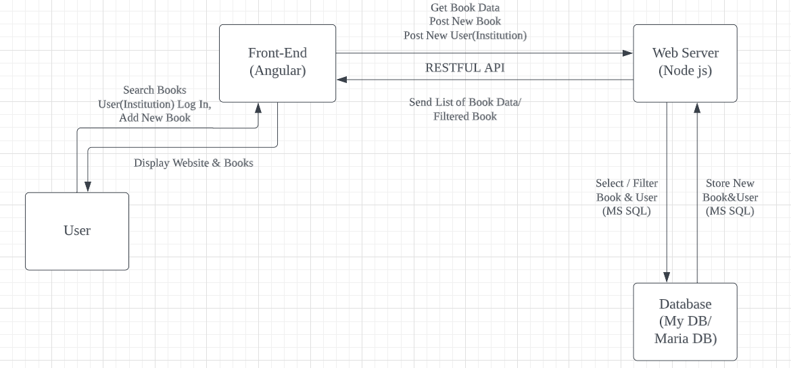

<!-----

You have some errors, warnings, or alerts. If you are using reckless mode, turn it off to see inline alerts.
* ERRORs: 0
* WARNINGs: 0
* ALERTS: 2

Conversion time: 1.259 seconds.

Using this Markdown file:

1. Paste this output into your source file.
2. See the notes and action items below regarding this conversion run.
3. Check the rendered output (headings, lists, code blocks, tables) for proper
   formatting and use a linkchecker before you publish this page.

Conversion notes:

* Docs to Markdown version 1.0β33
* Mon May 30 2022 15:48:40 GMT-0700 (PDT)
* Source doc: INFO 441 Final Project Proposal
* Tables are currently converted to HTML tables.
* This document has images: check for >>>>>  gd2md-html alert:  inline image link in generated source and store images to your server. NOTE: Images in exported zip file from Google Docs may not appear in  the same order as they do in your doc. Please check the images!

----->

>>>>>  gd2md-html alert:  ERRORs: 0; WARNINGs: 0; ALERTS: 2.

<ul style="color: red; font-weight: bold"><li>See top comment block for details on ERRORs and WARNINGs. <li>In the converted Markdown or HTML, search for inline alerts that start with >>>>>  gd2md-html alert:  for specific instances that need correction.</ul>

Links to alert messages:
<a href="#gdcalert1">alert1</a>
<a href="#gdcalert2">alert2</a>

>>>>> PLEASE check and correct alert issues and delete this message and the inline alerts.

## **Project Description **

For those whose primary language isn’t English, finding books in one’s own culture can be very difficult. In our project, we want to connect indigenous people who speak minoritized languages with public library books in their native tongue. Currently, after searching the American Library Association (ALA), the Society for American Archivists (SAA), and the Association for Tribal Libraries and Museums (ATALM), there are no tools available that can perform such duties as both a finding aid and as a data-driven illustration of library collections for minoritized and language-focused patrons. \
 \
As Developers, we want to build this tool to fill a niche and provide a usable social good to Public Library users and Library Administrators across the spectrum of cultures and languages. We envision an application built in collaboration with regional public libraries to encode less common languages or translated books in a way easily discoverable by native speakers. Our target audience is indigenous people seeking to discover more books in their native language. However, we also consider public library systems as another stakeholder in our application, because they will facilitate insertion of book and language data into our application. Those who wish to discover new books in their native language will want to use our application to greatly expedite the research process, as the relevant data is packaged in an intuitive and accessible manner. Conversely, libraries are incentivized to use our application as a means of attracting a wider range of readers.When implemented fully, our application will allow readers and libraries to connect with each other through a novel method.

## **Technical Description**

## Architectural Diagram

>>>>>  gd2md-html alert: inline image link here (to images/image1.png). Store image on your image server and adjust path/filename/extension if necessary.  (<a href="#">Back to top</a>)(<a href="#gdcalert2">Next alert</a>) >>>>> 

## User Stories Summary

<table>
  <tr>
   <td>Priority 
   </td>
   <td>User
   </td>
   <td>Description
   </td>
   <td>Technical Implementation
   </td>
  </tr>
  <tr>
   <td>P0
   </td>
   <td>As a member of the public
   </td>
   <td>I want to search for books in public libraries using my native language
   </td>
   <td>When pulling books out of the database, add a <strong>filter to the query</strong> (as opposed to having the server filter the database results, or the client filters what the server sent). 
   </td>
  </tr>
  <tr>
   <td>P1
   </td>
   <td>As a librarian
   </td>
   <td>I want to enter books with specific language to the website to make it available to the public
   </td>
   <td>Add a <strong>post</strong> function to the front end so that the user could store data into our database. 
   </td>
  </tr>
  <tr>
   <td>P2
   </td>
   <td>As a librarian
   </td>
   <td>I want replace old version books with newer version data
   </td>
   <td>When storing book data into the database, also include a function to <strong>link</strong> different versions of the same book under the same <strong>primary key</strong>.
   </td>
  </tr>
  <tr>
   <td>p3
   </td>
   <td>As a member of the public
   </td>
   <td>I want to have my own account on the website to receive personal book recommendations
   </td>
   <td>Use the <strong>auth tokens</strong> to allow users to create accounts in the database using their email. Storing user languages, and reading history to tune the feed in the personal page. 
   </td>
  </tr>
</table>

 

## Available Endpoints

GET /books/query?{terms}

* Perform a book search using language, title and region search terms

GET /books/{id}, POST /books/{id}

* Get or add book name, translation name, original language, date created, etc. Does not require authentication to access these endpoints

GET /library/signin, GET /library/signout

* These endpoints handle library institution authentication. A library entity can authenticate and go through a verification process. We will use Microsoft Identity Express

GET /error 

* Returned when a server error occurs

GET /library/unauthorized

* Used for redirects when a user does not have permission to make changes a library would make

## Database Entity Relationship Diagram \
 \

>>>>>  gd2md-html alert: inline image link here (to images/image2.png). Store image on your image server and adjust path/filename/extension if necessary.  (<a href="#">Back to top</a>)(<a href="#gdcalert3">Next alert</a>) >>>>> 

